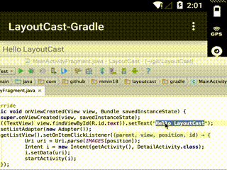

# LayoutCast

Android SDK sucks. It's so slow to build and run which waste me a lot of time every day.

LayoutCast is a little tool to help with that, it will cast every changes in your Java source code or resources (including library project) to your phone within 5 sec, and does not restart the hold application.

Youtube demo video: <https://youtu.be/rc04LK2_suU>

优酷: <http://v.youku.com/v_show/id_XMTMwMTk2OTk0OA>

## Features and Limits

- Fast cast code and resource changes, usually less than 5 sec.
- Cast does not reset the hole application. The running activity stack will be kept.
- Easy to setup, only add few lines of code.
- Support both eclipse and AndroidStudio project.
- Provide a AndroidStudio plugin to click and cast.

Limits:

- LayoutCast only support Mac (for now)
- Cast Java code only support ART runtime (Android 5.0)

## Get Started for AndroidStudio

### Install Plugin

*If you have already done that, you can skip this step.*

Install the IntelliJ plugin in your AndroidStudio by downloading <https://github.com/mmin18/LayoutCast/raw/master/ide/IDEAPlugin/IDEAPlugin.jar> and install plugin in `Preferences` > `Plugins` > `Install plugin from disk...`

After restart, you should find a button at right of the run section: 

### Dependency and startup changes

Next you need to setup your project. Add the dependency in your build.gradle:

	dependencies {
		compile 'com.github.mmin18.layoutcast:library:1.+@aar'
		...
	}

Add the following code in your application onCreate(). And since LayoutCast is only necessary when you develop, you should always check if the BuildConfig.DEBUG == true.

	public class MyApplication extends Application {
		@Override
		public void onCreate() {
			super.onCreate();

			if (BuildConfig.DEBUG) {
				LayoutCast.init(this);
			}
		}
	}

Also don't forget to check if this Application class is registered in AndroidManifest.xml:

    <application
        android:name=".MyApplication"
		...

Add an activity in your manifest, this is only used to reset the running process to make the application restart and restore its activity stack.

	<activity android:name="com.github.mmin18.layoutcast.ResetActivity" />

And make sure you have the network permission in your AndroidManifest.xml:

    <uses-permission android:name="android.permission.INTERNET" />

### Run and cast

You need to run the application first, then make some changes in your project.

Click the LayoutCast button in toolbar (on the right of Run button) or go to menu `Tools`> `Layout Cast`.

It will show the result above status bar:

## Get started for Eclipse

### Prepare the cast script

I haven't write the Eclipse plugin yet, so if you need to use it on a eclipse project, you need to use the command line.

It's a python 2.7 script which you can get here <https://raw.githubusercontent.com/mmin18/LayoutCast/master/cast.py>. You can put it in project root dir or anywhere you like.

### Dependency and startup changes

Since it does not build with gradle, you need to manually download the library <https://github.com/mmin18/LayoutCast/raw/master/libs/lcast.jar> to your /libs folder.

Everything else is the same as AndroidStudio.

### Run and cast

Run the application first, and open terminal and execute **python cast.py** under your project's folder:

	cd <project path>
	python cast.py

Or you can specify the path in args:

	python cast.py <project path>

## How it Works

When **LayoutCast.init(context);**, the application start a tiny http server in the background, and receives some certain commands.

The cast script running on your computer communicates with the apps running on your phone through ADB TCP forward.

When the cast script runs, it scans all possible ports on your phone to find the running LayoutCast server, and get the running application's resource list with its id, in which is compiled to public.xml that will be used later to keep resource id index consistent with the running application.

It than scans your project folder to find the /res folder, and all dependencies's /res folder. Run the **aapt** command to package all resources into **res.zip**, and then upload the zip file to the LayoutCast server to replace the resources of the running process. Then it calls the **Activity.recreate()** to restart the visible activity.

Usually the activity will keep its running state in **onSaveInstanceState()** and restores when it come back later.

## Troubleshooting

- It can only find /src folder under <project>/src or <project>/src/main/src
- It can only find /res folder under <project>/res or <project>/src/main/res
- You can add new or replace resources, but you can't delete or rename resources (for now)
