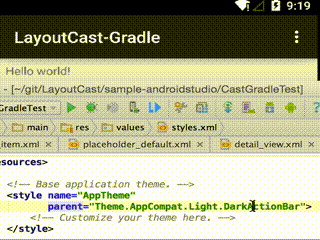
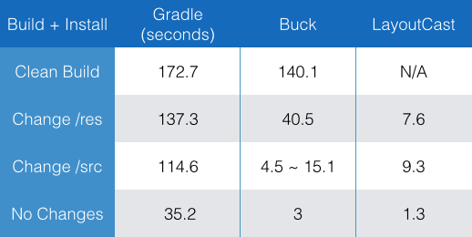

*Android SDK sucks. It's so slow to build and run which waste me a lot of time every day.*

## Motivation

Facebook Buck <http://github.com/facebook/buck> build is fast. However, the biggest problem with Buck is, it requires you to change a lot of codes, and restructs your project in small modules. Indeed, it is troublesome to just make it work properly on the existing android project, especially if you have big project. I have tried using Buck build system instead of Gradle on my test project. However, it took me a week just to make it work.

What I needs is a build tool that is easy to setup, fast as Buck, and provide a Run button in Android Studio. So I created LayoutCast.

**LayoutCast** is a little tool to help with that, it will cast every changes in your Java source code or resources (including library project) to your phone or emulator within 5 sec, and does not restart your application.

把代码和资源文件的改动直接同步到手机上，应用不需要重启。省去了编译运行漫长的等待，比较适合真机调试的时候使用。

Youtube demo video: <https://youtu.be/rc04LK2_suU>

优酷: <http://v.youku.com/v_show/id_XMTMwNTUzOTQ3Mg>

## Features

- Fast cast code and resource changes, usually less than 5 sec.
- Cast does not reset your application. The running activity stack will be kept.
- Easy to setup, only add few lines of code.
- Support both eclipse and AndroidStudio project.
- Provide a AndroidStudio plugin to click and cast.

## Limitations

- LayoutCast only support Mac (for now)
- Cast Java code only support ART runtime (Android 5.0)

## Benchmarks

Here is how it compared to Gradle and Facebook Buck:

The test machine is a 2015 MBP with a 2014 MotoX.

The test project's apk is about 14.3MB, which contains 380k lines of java code and 86k lines of xml files.

## Getting Started for Android Studio / Intellij

### 1. Install Plugin

*If you have already done that, you can skip this step.*

1. Download Android Studio / Intellij plugin <https://github.com/mmin18/LayoutCast/raw/master/ide/IDEAPlugin/IDEAPlugin.jar>
2. In Android Studio, go to `Preferences` > `Plugins` > `Install plugin from disk...`
3. Choose the downloaded file from step #1 to install the plugin.

After restart, you should find a button at right of the run section: 

### 2. Android Project & Build System Changes

**First,** you need to setup your project. Add below dependency in your build.gradle:

	dependencies {
		compile 'com.github.mmin18.layoutcast:library:1.+@aar'
		...
	}

**Second,** add the following code in your main application class inside `onCreate()` method. And since LayoutCast only necessary when you develop, you should always check if `BuildConfig.DEBUG == true`.

	public class MyApplication extends Application {
		@Override
		public void onCreate() {
			super.onCreate();

			if (BuildConfig.DEBUG) {
				LayoutCast.init(this);
			}
		}
	}

**Thrid,** don't forget to check if your Application class is registered in `AndroidManifest.xml`:

    <application
        android:name=".MyApplication"
		...

**Fourth,** add special activity class (from LayoutCast library) called `ResetActivity` in your manifest, this activity will be used to restart and restore our application activity stack.

	<activity android:name="com.github.mmin18.layoutcast.ResetActivity" />

And make sure you have the network permission in your `AndroidManifest.xml`:

    <uses-permission android:name="android.permission.INTERNET" />

### 3. Run and cast

Run the application (in device or emulator), then try to make some changes for resources file or java file.

After that, click the LayoutCast button in toolbar (on the right of Run button) / go to menu `Tools`> `Layout Cast`.

It will show the result above status bar:

## Getting started for Eclipse

### 1. Prepare the cast script

I haven't written the Eclipse plugin yet, so if you need to use it on a eclipse project, you can try to use the command line.

You can get the script here <https://raw.githubusercontent.com/mmin18/LayoutCast/master/cast.py>. Put the script in project root dir or anywhere you like. Since it is written in Python 2.7 (make sure you have installed the right version). 

### 2. Android Project & Build System Changes

To get it work, we will need to download the LayoutCast library <https://github.com/mmin18/LayoutCast/raw/master/libs/lcast.jar> and put it to your `/libs` folder.

The project structure will remain the same.

### 3. Run and Cast

Run the application first, and open terminal and execute **python cast.py** under your project's folder:

	cd <project path>
	python cast.py

Or you can specify the path in args:

	python cast.py <project path>

## How it Works

When **LayoutCast.init(context);** called, the application will start tiny http server in the background, and receive certain commands. Later on, the cast script running on your computer will communicate with your running app which is running through ADB TCP forward.

When the cast script runs, it will scan all possible ports on your phone to find the running LayoutCast server, and get the running application's resource list with its id, then compiled to `public.xml`. In which, it will be used later to keep resource id index consistent with the running application.

The cast script scans your project folder to find the `/res` folder, and all dependencies inside `/res` folder. You can run the **aapt** command to package all resources into **res.zip**, and then upload the zip file to the LayoutCast server to replace the resources of the running process. Then, it calls the **Activity.recreate()** to restart the visible activity.

Usually the activity will keep its running state in **onSaveInstanceState()** and restore after coming back later.

## Troubleshootings

- It can only find `/src` folder under `<project>/src` or `<project>/src/main/src`
- It can only find `/res` folder under `<project>/res` or `<project>/src/main/res`
- You can add or replace resources, but you can't delete or rename resources (for now)
- If cast failed, clean your project, remove `/bin` and `/build` and rebuild again may solve the problem
